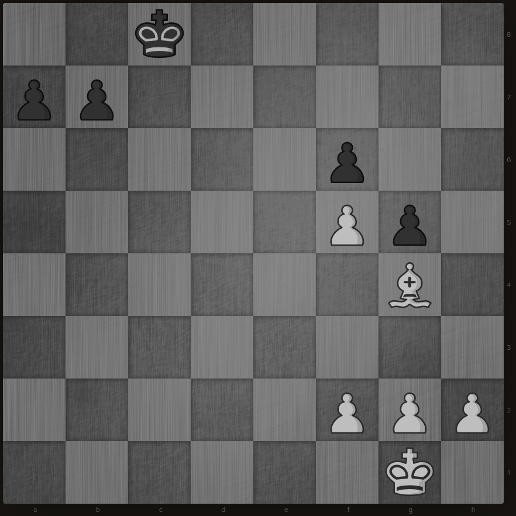

+++
title = "Writing a BitBoard in Rust Pt. 2: The Game State"
date = "2021-09-14T08:11:54+02:00"
author = ""
authorTwitter = "" #do not include @
cover = ""
draft = true
tags = ["bitboard", "chess", "rust"]
keywords = ["bitboard", "chess", "rust"]
description = "Now that we have a bitboard to store the pieces, we need a way to store the game state"
showFullContent = false
+++


In [the last blog post]() we created `BitBoard`s and stored them inside a `Position`.
To evaluate a position we need more than the positioning of the pieces sometimes though. En-passant is a good example 
of this:
[](https://lichess.org/editor/2k5/pp6/5p2/5Pp1/6B1/8/5PPP/6K1_w_-_-_0_1)
In this position capturing the pawn on g5 with En Passant is the best move if available since it allows us to promote a 
pawn. Just looking at the board though we cannot be sure that en passant is a legal move.

## Explanation

So we need additional information in order to evaluate the position. This will be stored in the struct called `State`, 
which contains all necessary information to evaluate a position outside the pieces positions.

So it contains the:
- Castling rights 
- Half move counter
- Side to move
- En passant(if possible)

An implementation can look like this:
```rust
/// Contains castling_rights, move_clocks, en_passant_square if possible and the side to move
#[derive(Debug, Clone, Hash, Eq, PartialEq)]
pub struct State {
    castling_rights: CastlingRights,
    en_passant_square: Option<Square>,
    half_move_counter: u8,
    stm: usize,
}
```

In order to define castling rights efficiently we do it similar to Stockfish. We define an u8 to store the castling
rights. The first 4 bits are unused and the latter ones are used to store one castling right.
```rust
/// Castling rights are stored in a [`u8`], which is divided into the following parts:
/// ```text
/// 0 1 0 1   1                1               0                0
/// ^^^^^^^   ^                ^               ^                ^
/// unused    Black queen side Black king side White queen side White king side
/// ```
#[derive(Debug, Clone, Hash, Eq, PartialEq)]
pub struct CastlingRights(u8);

impl CastlingRights {
    fn empty() -> Self {
        Self(Castling::NO_CASTLING)
    }
    fn all() -> Self {
        Self::default()
    }
}

impl Default for CastlingRights {
    fn default() -> Self {
        Self(Castling::ANY_CASTLING)
    }
}
```

And a helper struct to more easily use `CastlingRights`, which I put in my defs.rs:
```rust
/// Provides labels for the [`CastlingRights`]
pub struct Castling;
impl Castling {
    pub const NO_CASTLING: u8 = 0;
    pub const WHITE_00: u8 = 0b00000001;
    pub const WHITE_000: u8 = 0b00000010;
    pub const BLACK_00: u8 = 0b00000100;
    pub const BLACK_000: u8 = 0b00001000;

    pub const KING_SIDE: u8 = Self::BLACK_00 | Self::WHITE_00;
    pub const QUEEN_SIDE: u8 = Self::BLACK_000 | Self::WHITE_000;
    pub const WHITE_CASTLING: u8 = Self::WHITE_00 | Self::WHITE_000;
    pub const BLACK_CASTLING: u8 = Self::BLACK_00 | Self::BLACK_000;
    pub const ANY_CASTLING: u8 = Self::BLACK_CASTLING | Self::WHITE_CASTLING;
}
```

And we also need a way to represent squares in order to use en_passant_square, which we can nicely do with an enum in 
Rust:
```rust
#[derive(Hash, PartialEq, Eq, Debug, Clone)]
/// Represents a single square on the board.
/// # Representation
/// 1 is A1
/// 2 is B1
/// 64 is H8
pub struct Square(usize);

/// Labels for every [`Square`] on the board.
#[repr(usize)]
#[rustfmt::skip]
pub enum SquareLabels {
    None,
    A1, B1, C1, D1, E1, F1, G1, H1,
    A2, B2, C2, D2, E2, F2, G2, H2,
    A3, B3, C3, D3, E3, F3, G3, H3,
    A4, B4, C4, D4, E4, F4, G4, H4,
    A5, B5, C5, D5, E5, F5, G5, H5,
    A6, B6, C6, D6, E6, F6, G6, H6,
    A7, B7, C7, D7, E7, F7, G7, H7,
    A8, B8, C8, D8, E8, F8, G8, H8,
}
```

And lastly we need to add the `State` to the `Position`:

```rust
/// A Position contains everything necessary to calculate moves and evaluate a position.
#[derive(Debug, Clone, Hash, PartialEq, Eq)]
pub struct Position {
    /// The board for each side
    bb_sides: [BitBoard; 2],
    /// BitBoards for all pieces and each side
    bb_pieces: [[BitBoard; 6]; 2],
    /// State contains all relevant information for evaluating a position outside the pieces.
    state: State,
}
```

## Credits and further reading

Many articles and projects have helped me in the writing of this Blog Post, notably:

- the [Chess Programming Wiki](https://www.chessprogramming.org/Bitboards)
- the [rustic project](https://rustic-chess.org/)
- the [rust-move-gen](https://github.com/peterellisjones/rust_move_gen)
- the [Chess Engine in C Series](https://youtube.com/playlist?list=PLZ1QII7yudbc-Ky058TEaOstZHVbT-2hg)