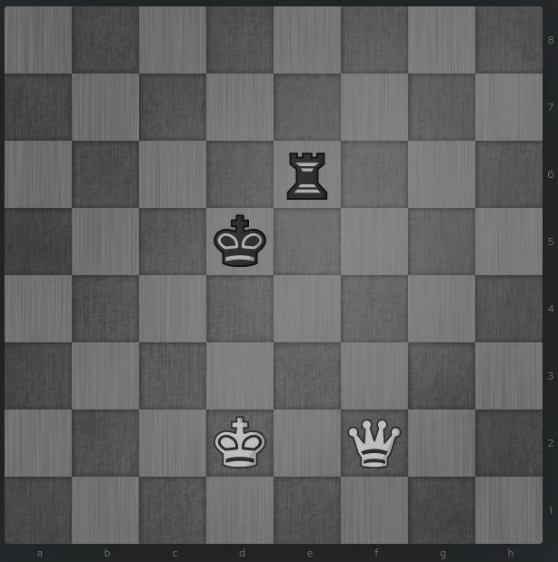
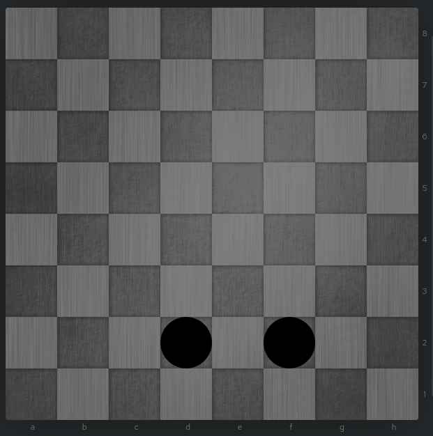
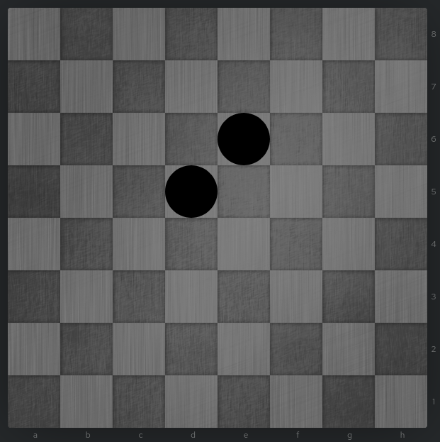
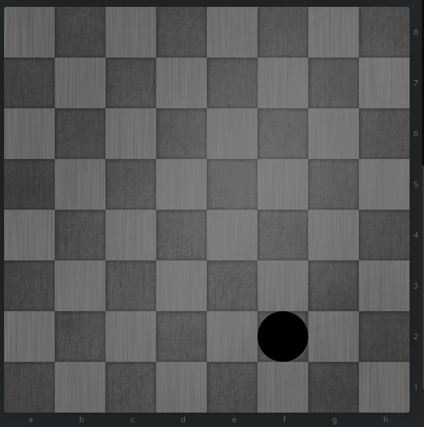
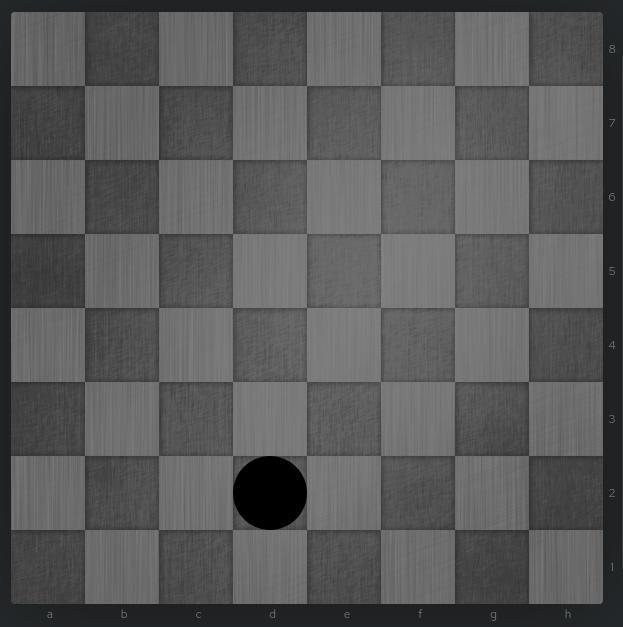

+++
title =  "Writing a BitBoard in Rust Pt. 1: The Basics"
date = 2021-08-23T22:19:48+02:00
author = ""
toc = false
description = "BitBoards are used in the fastest chess engines on the market. So how do they work? And how do we implement them?"
keywords = ["rust", "chess", "bitboard"]
tags = ["bitboard", "chess", "rust"]
+++


## Why BitBoards?

BitBoards are used in most successful chess engines for the following reasons:

### Speed

The biggest reason to use BitBoards is speed. That's why all major chess engines use them.
Since they only use one instruction per operation on 64-bit CPUs they are the naturally fastest way to make moves.

### Memory

The second reason to use BitBoards is because they are the most efficient way to store a board,
which becomes relevant for the search in chess engines, since many boards are in memory during search.

But if you just want to make a chess browser game where memory or speed is not of great concern you really don't need BitBoards.

## Explanation

A BitBoard is essentially a 64-bit number with 1 bit for every square of a chess board.

Obviously we can only discern between piece and no piece here, so we have to have multiple BitBoards to store both teams
and all 6 pieces.

So a position that looks like this:
[](https://lichess.org/editor/8/8/4r3/3k4/8/8/3K1Q2/8_w_-_-_0_1)

Would be split into the following BitBoards:

Note that a 0 is represented with nothing and a 1 is represented with a black dot and the dark and light squares are also all just bits but this makes it easier to read.

### White Pieces



### Black Pieces



### White Queens



### White Kings



There would also be another BitBoard for Black Kings, Black Rooks and a bunch of empty BitBoards for the pieces which are not present on this board, but I think you get the concept.

## Implementation

So creating a BitBoard is pretty easy:

```rust
pub struct BitBoard(pub u64)
```

Now we can derive a bunch of traits:

```rust
#[derive(PartialEq, Eq, PartialOrd, Clone, Copy, Debug, Default, Hash)]
pub struct BitBoard(pub u64);
```

Now we can represent a chess board using BitBoards:

```rust
#[derive(Debug, Clone, Hash, PartialEq, Eq)]
pub struct Position{
    /// Board for each side
    bb_sides: [BitBoard; 2],
    // BitBoards for all pieces and each side
    bb_pieces: [[BitBoard; 6]; 2],
}
```

For efficiency reasons we only store the position and not the move order etc. since that is irrelevant for evaluation.

For ease of use we should also "label" the BitBoards something

```rust
pub struct Sides;
impl Sides {
    pub const WHITE: usize = 0;
    pub const BLACK: usize = 1;
}

pub struct Pieces;
impl Pieces{
    pub const PAWN: usize = 0;
    pub const BISHOP: usize = 1;
    pub const KNIGHT: usize = 2;
    pub const ROOK: usize = 3;
    pub const QUEEN: usize = 4;
    pub const KING: usize = 5;
}
```

Now  we can access a specific BitBoard in a way that is easy to read:

```rust
let white_queens: BitBoard = position.bb_pieces[Sides::WHITE][Pieces::QUEEN]; 
```

## Conclusion

This is nice, but only having BitBoard to represent a position is not very useful, so in the next blog post we will explore how to implement States(Like En Passant, Side to Move, Move number etc.).
If you read this far, thank you for your patience and the next post will follow soon.

And of course you can check out the entire [source code](https://github.com/Nereuxofficial/BitBoard).

## Credits and further reading

Many articles and projects have helped me in the writing of this Blog Post, notably:

- the [Chess Programming Wiki](https://www.chessprogramming.org/Bitboards)
- the [rustic project](https://rustic-chess.org/)
- the [rust-move-gen](https://github.com/peterellisjones/rust_move_gen)
